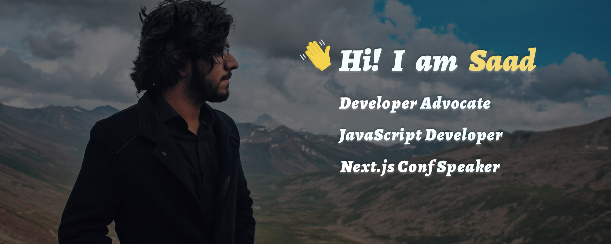

### ⚡️ Here is a bit about me

- *JavaScript Developer who mostly works with different **frontend** technologies.*
- *Proficient technologies and tools: **React.js, Next.js, Node.js, RESTful APIs, Firebase (Firestore), MongoDB, Git, VSCode***
- *Has a nag for developing **automation tools***
- *Open-sourcerer with more than [**20 tools and apps**](https://github.com/msaaddev/open-source) authored*
- *[**Next.js Conf Speaker**](https://nextjs.org/conf/speakers/msaaddev) – [Watch my talk](https://www.youtube.com/watch?v=6EOZf-FOUDI&ab_channel=Vercel)*
- *Featured in [**Node Weekly**](https://nodeweekly.com/issues/397) and [**JavaScript Weekly**](https://javascriptweekly.com/issues/547) (subscribed by half a million developers) for my open-source work*
- *Former fellow at **Major League Hacking***
- *Former **Jr. Developer Advocate** at [Worwox](https://github.com/worwox)*
- *Technical Writer at [**Dev.to**](https://dev.to/msaaddev) and [**TheDevCouple**](https://thedevcouple.com/author/muhammadsaad/)*
- *Speaker with various **talks** delivered in many notable communities and universities*
- *Former [**instructor**](https://www.youtube.com/watch?v=l6U7pXfyuP4&list=PLjjqsCGTfaD7CVJqN3GQdxjHUxEAS1v6B) at ASME UET Chapter where I taught **frontend development** to Mechanical Engineers*
- *Founder and former Lead of [**Google DSC UET Chapter**](https://dsc.community.dev/university-of-engineering-and-technology-lahore/) (Part of 1st cohort)*
- *Former Beta level **Microsoft Learn Student Ambassador***
- *Former **Web Dev Team Lead** of ACM UET Chapter*
- *Bachelors in Computer Sciences*

